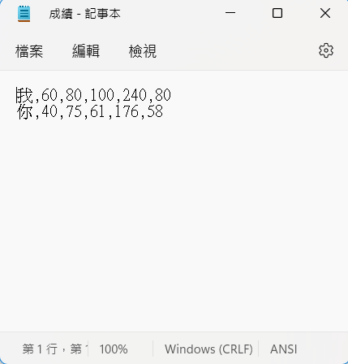

# Calendar
## 利用Netbean作為IDE，自己看書學習Java並且使用基本的流程控制和讀寫檔案的API實作出輸入成績的視窗程式，在使用者輸入名稱和分數後計算平均和總分並寫入到文字檔中，也能讀取已經在文字檔中的名稱和對應的成績。  
  
## 大致步驟如下:  
1.將需要的JButton與JTextbox拖出來  
2.簡單設計一下排版  
3.寫好讀取和寫入成績檔案的程式  
4.把所有輸入框的程式寫好，並設定成績範圍在0~100之間，不在區間的會跳出通知  
5.完成所有後檢查最終的排版  

## 待解決的問題:  
把視窗放大後比例會跑掉，只有按鈕會跟著視窗變化

## 預期解法:  
學習控制layout，在使用者放大視窗後，物件可以等比例放大  
  
### 註:.jar檔位於<https://github.com/Jiang-1211/Project-grade/tree/main/grade/dist>  
### 註:.java檔位於<https://github.com/Jiang-1211/Project-grade/tree/main/grade/src/grade>
## 視窗程式截圖  
.png)  
.png)  
.png)  
  
## 設計界面截圖  
.png)  
.png)  
  
## 程式截圖  
.png)  
.png)  
.png)  
.png)  
  
## 文字檔截圖  
   
  
